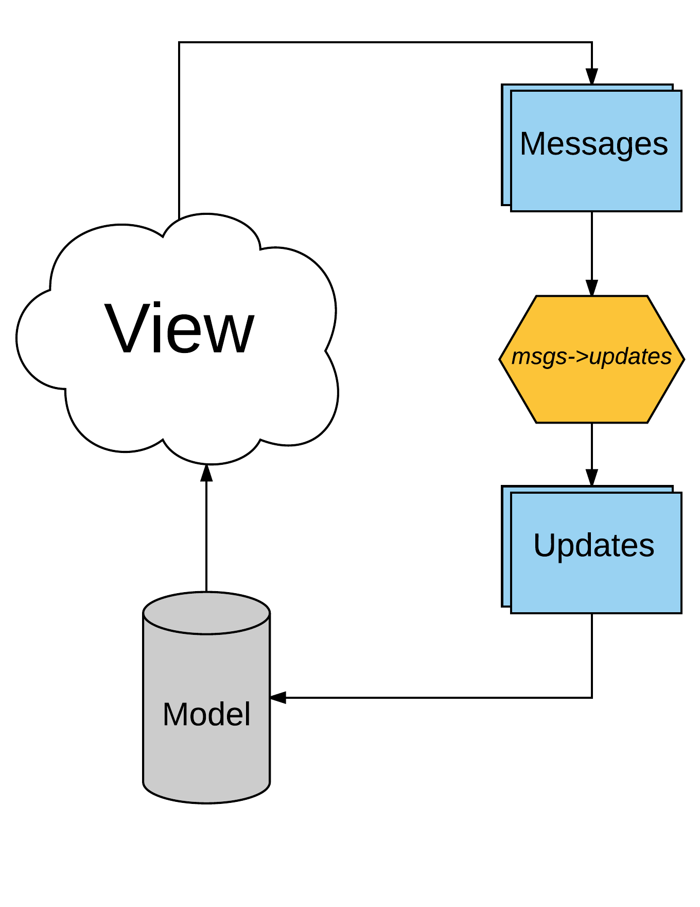
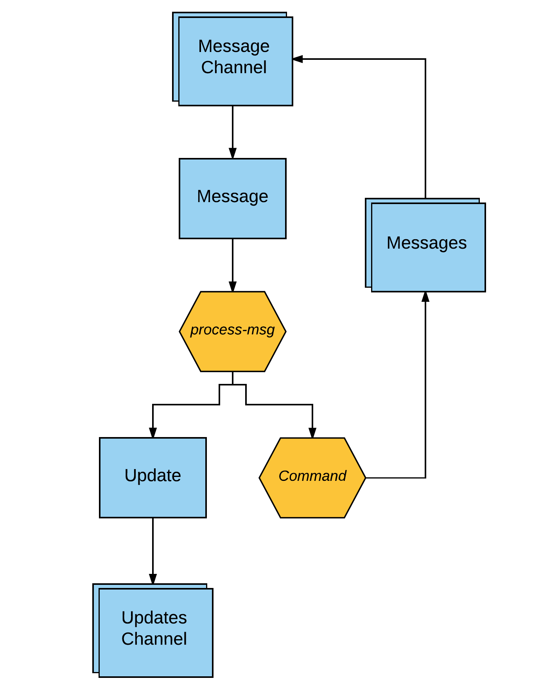

# Larch (Alpha)


Larch is a very minimal SPA "framework", loosely following the Elm architecture. The main goal of Larch is to provide an easy-to-use, simple, and testable framework for web apps. Handling asynchronous operations is a high priority. Performance is a lesser concern - if performance is an issue, please check out [Om](https://github.com/omcljs/om) or [Re-Frame](https://github.com/Day8/re-frame).

## Overview

The [Elm architecture](https://guide.elm-lang.org/architecture/) has 3 separate concerns: model, update and view. See [here](https://dennisreimann.de/articles/elm-architecture-overview.html) for a good explanation.

Larch is only concerned with the "update" part of this. The way it does this is slightly different to Elm, but is conceptually quite similar. The overall flow goes like this:

1. Every time an event happens that we care about (e.g. button click, browser window resize, etc.), we put a "message" on a channel.
2. Larch takes this channel, and transforms each message into an "update" - a data representation of an update to the model. We'll go into how this done later on.
3. Each update is used to update the model. For example, if our model is just a number, and we get an `:increment` update, we just increment our model.
4. The view is rendered from the new model value.



Notes:
* To make step 3 easier, it is recommended that you use [DataScript](https://github.com/tonsky/datascript) for your model, because then "updates" are just DataScript transactions. This isn't an absolute necessity though, Larch only assumes that your model is an atom.
* Larch is unopinionated about how you render your view, you can use any library that can render html from your model.

## So how does Larch work?

Larch's only concern is to transform a channel of messages into a channel of updates (step 2 above). This transformation is easy when it is a pure, synchronous function. In fact, we could just use a the `core.async` `pipeline` function on the message channel. However it becomes more difficult to manage, and test, when messages may trigger asynchronous actions (such as http requests), or need to interact with the (mutable) browser state (e.g. local storage). This is where Larch can help you. 

Larch tackles this problem in a similar way to Elm. You supply a `process-msg` function to Larch, which is similar to the `update` function in Elm. This function takes a message and the current model value, and returns a tuple of `[update, command]`. Since updates are data structures, the transformation from message to update is a pure, synchronous function. A "command" is an impure or async function, that returns a channel of messages. All your impure and asynchronous operations should be done here. The channel returned from a command is fed back in to the main message channel.

Commands take 2 parameters: the current model value, and a map of dependencies. You provide these "dependencies" to Larch. All impure functions that commands call should be in this map - this makes commands testable. 

This diagram illustrates the overall process:



## Sounds great, so how do I get going with Larch?

Larch consists of just a single function, `msgs->updates!`. This basically transforms a channel of messages to a channel of updates, as described above. It takes the following arguments:

* `msg-chan` - a channel of all the messages that your app cares about. These messages may be triggered by user interaction, or other global events (loss of internet connection, time changes, etc.). These events can be in any format whatsoever (e.g. strings, keywords, tuples), but it is recommended to use the format `[message-type payload...]`.
* `model` - an atom containing the entire state of your app.
* `dependencies` - a map containing any impure functions and references to mutable objects that your app needs. For example, if your app needs to make http requests, and also update local storage, your dependencies may look like: `{:fetch js/fetch :local-storage js/localStorage}`. These are provided to command functions.
* `process-msg` - a function which takes an event and the model value (i.e. the value of the `model` atom), and returns a tuple of `[update, command]`. Both elements in the tuple are optional - if they are `nil` they will be ignored.

## That sounds good, now how do I update my model?

Updating the model is easiest if you use DataScript. Each update will be a transaction, so you just have run `transact!` for each update. For example:

``` clojure
(go-loop []
  (let [update (<! updates-channel)]
    (datascript.core/transact! model update)
    (recur)))
```

You can take a similar approach if your model is a standard Clojure data structure, but you will effectively have to implement `transact!` yourself, to update the model based on the update.

## So far so good, but I'm still not seeing anything rendered...

Rendering the view depends on which library you use to render your html. If you're using Reagent, then you just have to re-render your root component on every model update, passing it the model value. You can do this by adding a watch to the model:

``` clojure
(defn reload []
  (reagent/render [root-component @app-model]
                  (.getElementById js/document "app")))

(add-watch app-model :render reload)
```

The same approach should work for all react-based view libraries.

## Just one more thing - how we handle user interaction?

Larch doesn't make any assumptions about how messages are actually created - all it knows about is the message channel. Therefore, we just need to somehow set up event handlers which `put!` messages onto the message channel. How you do this will depend on which view library you're using, but let's consider how it would work using Reagent.

Suppose we want to do something when the user clicks the submit button in the `my-awesome-form` component. On the click event, we'll emit a `:my-awesome-form/submit` message. To do this, we pass the message channel to our root component, then down to the `my-awesome-form` component. The `my-awesome-form` component then puts a new message on the channel in the button click event, like so:

``` clojure
(defn my-awesome-form [message-chan]
  [:form
    [:button {:on-click #(go (put! message-chan [:my-awesome-form/submit %]))}]])
```

## Examples

For a reference example, please see [monzo-cljs](https://github.com/DaveWM/monzo-cljs).

## License

Distributed under the GPL V3 license.
